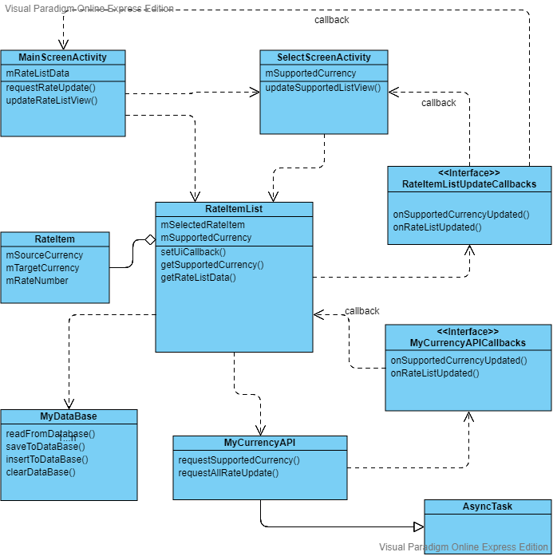

### About this application What we're looking for:

#### About my coding style:
    The most thing I care about when I coding is the readablity of the code. 
    Even for a reader does not have much knowledge on Java laguage, he should be able to understand the code (as the natural lauguage).
#### About the Architecture:
    I have a class diagram to explain my idea:
    
    
    The baseic designed is based on MVP design pattern. 
    Model is the "MyCurrencyAPI" and "MyDataBase" class.
    View is the "MainScreenActivity" and "SelectScreenActivity"
    Presenter is "RateItemList" class
    
    Since geting the exchange rate is a time-comsuming task, I implimented the task using "AsyncTask".
    Therefore, the result need to be updated via Callback method. 
    
    "RateItemList" will notify the view classes to update when data is fetched.     
    "MyCurrencyAPI" gets the web data.
    "MyDataBase" saves the lates data locally.
    
#### About My Principles
1) Seperate "view" and "model" and "presenter". 
2) Seperate different fucntions into different classes. 
3) Simplize the interfaces between the classes. 

